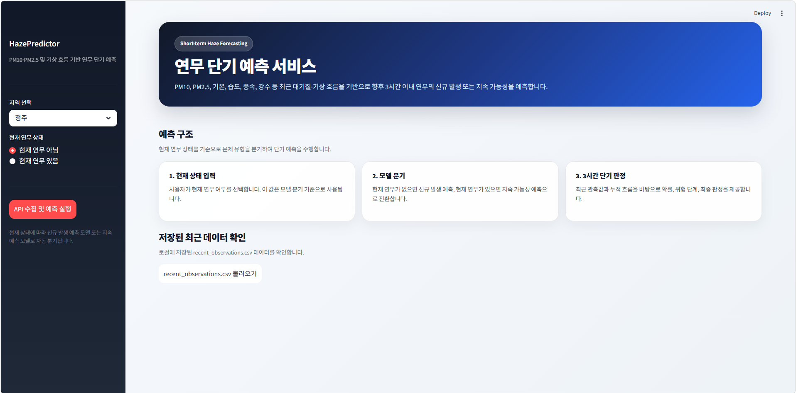

# 🌫️ Hazepredictor

<div align="center">

### PM10·PM2.5 및 기상 데이터 기반 연무 단기 예측 서비스

현재 연무 상태와 최근 대기질·기상 관측 데이터를 기반으로  
향후 3시간 이내의 **연무 신규 발생 가능성** 또는 **연무 지속 가능성**을 예측합니다.

<br/>


</div>

---

## 📌 Project Overview

**Hazepredictor**는 PM10, PM2.5, 기온, 습도, 풍속, 강수 여부 등 대기질 및 기상 데이터를 활용하여 연무 발생 가능성을 예측하는 머신러닝 기반 서비스입니다.

단순히 현재 대기 상태를 확인하는 것이 아니라, 현재 연무 여부에 따라 예측 문제를 분기하여 **향후 3시간 이내의 연무 상태 변화**를 판단하는 것을 목표로 합니다.

---

## 🎯 Prediction Task

Hazepredictor는 현재 연무 상태에 따라 두 가지 예측 문제를 수행합니다.

| 현재 상태 | 예측 대상 | 설명 |
|---|---|---|
| 현재 연무 아님 | Onset Prediction | 향후 3시간 이내 연무가 새롭게 발생할 가능성 예측 |
| 현재 연무 있음 | Persistence Prediction | 향후 3시간 이내 연무가 지속될 가능성 예측 |

이 구조는 연무가 없는 상황과 이미 발생한 상황의 조건이 서로 다를 수 있다는 점을 반영합니다.

---

## ✨ Key Features

- 지역 선택 기반 연무 예측
- API 기반 최근 대기질·기상 데이터 수집
- 현재 연무 상태에 따른 예측 모델 자동 분기
- 향후 3시간 이내 연무 신규 발생 또는 지속 가능성 예측
- 예측 확률, 위험 단계, 최종 판정 제공
- 최근 관측값 및 최근 30시간 누적 데이터 확인
- Streamlit 기반 대시보드 UI 제공

---

## 🧠 Prediction Flow

```text
지역 선택
   ↓
현재 연무 상태 입력
   ↓
API 기반 최근 관측 데이터 수집
   ↓
최근 대기질·기상 흐름 데이터 구성
   ↓
현재 연무 상태에 따라 모델 분기
   ↓
Onset 또는 Persistence 예측
   ↓
예측 확률 · 위험 단계 · 최종 판정 출력
```

---

## 🖥️ Dashboard

Streamlit 대시보드는 다음 정보를 제공합니다.

| Section | Description |
|---|---|
| 현재 연무 상태 | 사용자가 입력한 현재 연무 여부 |
| 사용 모델 | onset 또는 persistence 모델 |
| 예측 확률 | 연무 신규 발생 또는 지속 가능성 |
| 위험 단계 | 예측 확률 기반 위험 수준 |
| 최종 판정 | 향후 3시간 이내 연무 가능성 판단 |
| 최근 관측값 | 최신 대기질·기상 관측값 |
| 누적 데이터 | 최근 30시간 관측 데이터 |

---

대시보드 스크린샷



---

## 📊 Main Input Features

| Feature | Description |
|---|---|
| datetime | 관측 시각 |
| PM10 | 미세먼지 농도 |
| PM25 | 초미세먼지 농도 |
| Temp | 기온 |
| Humidity | 습도 |
| WindSpeed | 풍속 |
| Rain | 강수 여부 |
| Shower | 소나기 여부 |

---

## 🗂️ Project Structure

```text
Hazepredictor/
├── app.py                      # Streamlit dashboard entry point
├── src/
│   ├── service.py              # Prediction service logic
│   ├── station_mapper.py       # Region and station mapping logic
│   ├── data_store.py           # Recent observation data loading/saving
│   └── ...
├── data/
│   └── recent_observations.csv # Recently collected observation data
├── models/
│   └── ...                     # Trained prediction models
├── requirements.txt
└── README.md
```

---

## ⚙️ Installation

### 1. Clone Repository

```bash
git clone https://github.com/ssy04150926/Hazepredictor.git
cd Hazepredictor
```

### 2. Create Virtual Environment

```bash
python -m venv venv
```

Windows:

```bash
venv\Scripts\activate
```

macOS / Linux:

```bash
source venv/bin/activate
```

### 3. Install Dependencies

```bash
pip install -r requirements.txt
```

---

## 🚀 Run Streamlit App

```bash
streamlit run app.py
```

실행 후 브라우저에서 Streamlit 대시보드가 열립니다.

---

## 📦 Requirements

예시 `requirements.txt` 구성은 다음과 같습니다.

```txt
streamlit
pandas
numpy
scikit-learn
joblib
requests
```

프로젝트에서 사용하는 라이브러리에 따라 추가 패키지가 필요할 수 있습니다.

---

## 🔍 How to Use

1. 사이드바에서 예측할 지역을 선택합니다.
2. 현재 연무 상태를 선택합니다.
   - 현재 연무 아님
   - 현재 연무 있음
3. `API 수집 및 예측 실행` 버튼을 클릭합니다.
4. 예측 확률, 위험 단계, 최종 판정을 확인합니다.
5. 최근 관측값과 최근 30시간 누적 데이터를 함께 확인합니다.

---

## 📈 Output Example

예측 결과는 다음과 같은 형태로 제공됩니다.

| Output | Description |
|---|---|
| 현재 상태 | 사용자가 입력한 현재 연무 여부 |
| 사용 모델 | onset 또는 persistence |
| 예측 확률 | 연무 신규 발생 또는 지속 가능성 |
| 위험 단계 | 모델 기준에 따른 위험 수준 |
| 최종 판정 | 향후 3시간 이내 연무 가능성 판단 |

---

## 🧩 Model Design

Hazepredictor는 현재 연무 여부를 기준으로 예측 문제를 분리합니다.

### 1. Onset Model

현재 연무가 없는 상황에서 향후 3시간 이내 연무가 새롭게 발생할 가능성을 예측합니다.

```text
현재 연무 아님 → 신규 연무 발생 가능성 예측
```

### 2. Persistence Model

현재 연무가 존재하는 상황에서 향후 3시간 이내 연무가 계속 유지될 가능성을 예측합니다.

```text
현재 연무 있음 → 연무 지속 가능성 예측
```

이 방식은 연무 발생 전 조건과 연무 발생 후 지속 조건이 서로 다를 수 있다는 점을 반영하기 위한 구조입니다.

---

## 🛠️ Tech Stack

| Category | Technology |
|---|---|
| Language | Python |
| Dashboard | Streamlit |
| Data Processing | Pandas, NumPy |
| Machine Learning | Scikit-learn |
| Model Storage | Joblib |
| Data Source | Air quality and meteorological observation APIs |

---

## ⚠️ Limitations

현재 프로젝트는 프로토타입 단계이며, 다음과 같은 한계가 있을 수 있습니다.

- API 수집 데이터의 결측 또는 지연 가능성
- 지역별 관측소 차이에 따른 데이터 품질 편차
- 연무 라벨 정의 방식에 따른 예측 성능 차이
- 계절 및 시간대별 데이터 불균형 가능성
- 실제 연무 발생에는 시정, 습도, 대기 정체, 오염물질 축적 등 다양한 요인이 함께 작용할 수 있음

---

## 🔮 Future Improvements

- 모델 성능 비교 및 최적 모델 선정
- 지역별 모델 분리 또는 지역 특성 반영
- 실시간 자동 업데이트 기능 추가
- 예측 결과 시각화 강화
- 변수 중요도 및 예측 근거 제공
- 연무 발생 사례 기반 오류 분석
- 대시보드 배포 환경 구축

---

## 📄 License

This project is for academic and experimental purposes.

---

## 👤 Author

**Hazepredictor Project**  
Machine learning-based haze prediction using air quality and meteorological data.
